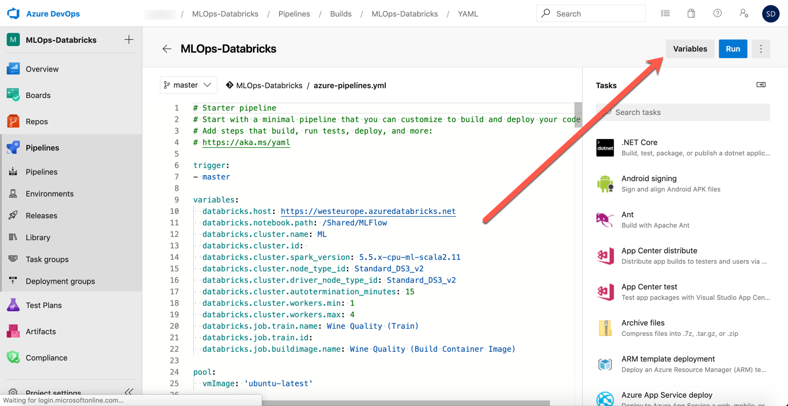
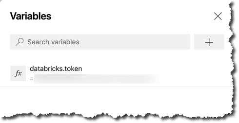
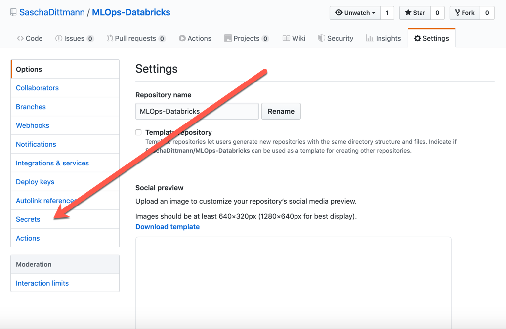
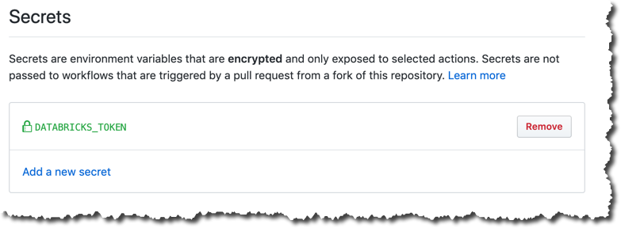
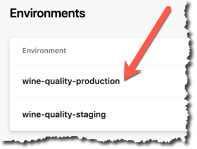

# MLOps for Azure Databricks Example

This repo is used in a tutorial for learning how to do DevOps for Machine Learning (also called MLOps) using Azure Databricks and Azure ML Services.

The DevOps Pipelines are defined using the [azure-pipelines.yml](./azure-pipelines.yml) for Azure DevOps, as well as [main.yml](./.github/workflows/main.yml) for GitHub Actions.

## Using This Sample Project

If you want to run this example in Azure DevOps, you need to prepare you enviroment with the following steps.

## Required Accounts And Resources

This examples uses Azure DevOps as an CI/CD toolset, as well as the Microsoft Azure platform to host you trained Machine Learning Model.

You can start with both platform completely free:

* [Sign up, sign in to Azure DevOps](https://docs.microsoft.com/en-us/azure/devops/user-guide/sign-up-invite-teammates?view=azure-devops)
* At the time of creating this tutorial, GitHub Actions were still beta. If you wan't to try this new feature, you have to [Sign up for the beta](https://github.com/features/actions) first.
* [Create a free Microsoft Azure account](https://azure.microsoft.com/en-us/free/)

### Azure Databricks Workspace

In your Azure subsciption, you need to [create an Azure Databricks workspace](https://docs.azuredatabricks.net/getting-started/try-databricks.html#step-2-create-a-databricks-workspace) to get started.

> NOTE: I recommend to place the Azure Databricks Workspace in a new Resource Group, to be able to clean everything up more easily afterwards.

## Importing This DevOps Project

As soon as you have access to the Azure DevOps platform, you're able to [create a project](https://docs.microsoft.com/en-us/azure/devops/user-guide/sign-up-invite-teammates?view=azure-devops#create-a-project) to host your MLOps pipeline.

As soon as this is created, you can [import this GitHub repository](https://docs.microsoft.com/en-us/azure/devops/repos/git/import-git-repository?view=azure-devops) into your Azure DevOps project.

## Set up The Build Pipeline

By importing the GitHub files, you also imported the [azure-pipelines.yml](./azure-pipelines.yml) file.

This file can be used to create your first Build Pipeline.

> NOTE: In this Build Pipeline I'm using a preview feature called "[Multi-Stage Pipelines](https://docs.microsoft.com/en-us/azure/devops/pipelines/process/stages?view=azure-devops&tabs=yaml)". In order to use those, you should [enable this preview feature](https://docs.microsoft.com/en-us/azure/devops/project/navigation/preview-features?view=azure-devops).

## Connecting Azure Databricks

To be able to run this pipeline, you also need to connect your Azure Databricks Workspace.

Therefor, yor first need to [generate an access token](https://docs.azuredatabricks.net/dev-tools/api/latest/authentication.html#generate-a-token).

This token must be stored as encrypted secret in your Azure DevOps Build Pipeline...



> NOTE: The variable must be called *databricks.token*



... or your GitHub Project.



> NOTE: The GitHub Secret must be called *DATABRICKS_TOKEN*



## Connecting the Azure ML Service Workspace

### Step 1: Create Azure AD Service Principal

The Databricks-Notebooks for serving your model, will create an Azure Machine Learning Workspace (and other resources) for you.

To grant Azure Databricks access rights to your Azure Subscription, you need to create a Service Principal in your Azure Active Directory.

You can do that directly in the [Cloud Shell](https://docs.microsoft.com/en-us/azure/cloud-shell/overview) of the Azure Portal, by using one these two commands:

``` bash
az ad sp create-for-rbac -n "http://MLOps-Databricks"
```

> Least Privilege Principle: If you want to narrow that down to a specific Resource Group and Azure Role, use the following command

``` bash
az ad sp create-for-rbac -n "http://MLOps-Databricks" --role contributor --scopes /subscriptions/{SubID}/resourceGroups/{ResourceGroup1}
```

> Make a note of the result of this command, as you will need it in a later step.

### Step 2: Install / Update Databricks CLI

Azure Databricks has its own place to store secrets.

At the time of creating this example, this store can be only accessed via the Databricks command-line interface (CLI).

Therefor you should install this CLI on your local machine or in the Azure Cloud Shell.

``` bash
pip install -U databricks-cli
```

> NOTE: You need python 2.7.9 or later / 3.6 or later to install and use the Databricks command-line interface (CLI) 

### Step 3: Store Databricks Secrets

Using the Databricks CLI, you can now create your own section (scope) for your secrets...

``` bash
databricks secrets create-scope --scope azureml
```

... and add the required secrets to the scope.

``` bash
# Use the "tenant" property from the Azure AD Service Principal command output
databricks secrets put --scope azureml --key tenant_id
# Use the "appId" property from the Azure AD Service Principal command output
databricks secrets put --scope azureml --key client_id
# Use the "password" property from the Azure AD Service Principal command output
databricks secrets put --scope azureml --key client_secret

databricks secrets put --scope azureml --key subscription_id
databricks secrets put --scope azureml --key resource_group
databricks secrets put --scope azureml --key workspace_name
```

## OPTIONAL: Pre-Approval Checks (Azure DevOps)

To avoid high costs from the Azure Kubernetes Service, which will be created by the "Deploy To Production" job, I recommend that you [set up a Pre-Approval Check](https://docs.microsoft.com/en-us/azure/devops/pipelines/process/approvals?view=azure-devops) for the wine-quality-production environment.

This can be done in the Environments section of your Azure Pipelines.


